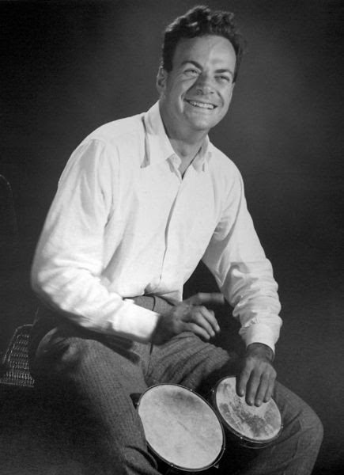

# Hi there, I’m Jorge Munoz 👋

## 🔭 About Me

I like STEM, adore a [Feynman a-like thinking](https://archive.org/details/surely-you-re-joking-mister-feynman-richard-feynman/page/10/mode/2up) . I don't disgust combining **mathematics** with **programming** to solve any kind of problems, modeling, abstract and **get fun**. (Duh).

* 🌱 I’m currently exploring [Neural Operators and variants](https://camlab-ethz.github.io/ai4s-course/)
* 🤔 I enjoy think and *theoretical* challenges as much as hands‑on coding. 
* ♟️ I *love/hate* chess. [Let's play a game!](https://www.chess.com/member/jorgemunozl).
* 🍅 *Pomodoro Lover* [(Strongly Recommended)](https://www.youtube.com/watch?v=sUwD3GRPJos)
* 🐧 Linux User : [Arch - I3](https://github.com/jorgemunozl/arch-i3-setup.git), Ubuntu Xorg.
* 🔮 Obsessed with the note-taking [Zettelkasten method](https://www.youtube.com/watch?v=E6ySG7xYgjY).

Richard Feynman playing the bongos, the most clever person that this world have ever known ! ->

## 💻 Languages & Libraries

* **Main Language:** Python, **Second Languages**: React, Node, Vite, Lua, Bash, C++, MatLab
* **Quantum Computing:** [Qiskit](https://qiskit-community.github.io/qiskit-nature/tutorials/11_quadratic_hamiltonian_and_slater_determinants.html)
* **ScientificAI** [PhysicsNemo](https://docs.nvidia.com/physicsnemo/latest/overview.html),
* **Deep  Learning :**  [Pytorch](https://docs.pytorch.org/docs/stable/index.html)
* **GenerativeA:** [Hugging Face Transformers](https://github.com/huggingface/transformers.git) [PEFT](https://github.com/huggingface/peft.git) [Datasets](https://github.com/huggingface/datasets.git)
* **Agentic AI:** [LangGraph](https://academy.langchain.com/?_gl=1*mi3mwc*_gcl_au*OTM1ODU4NjExLjE3NjEyNjQxNTc.*_ga*OTgyNjcwNzM0LjE3NjEyNjQxNTk.*_ga_47WX3HKKY2*czE3NjEyNjQxNTgkbzEkZzEkdDE3NjEyNjQxOTUkajIzJGwwJGgw)
* **Other Tools:** Git & GitHub, Jupyter Notebooks, VS Code Tunnels, [GPU rents via SSH RunPod ](https://console.runpod.io/)  , Docker, [Latex](https://github.com/jorgemunozl/arch-nvim-latex.git) ,[Zotero](https://github.com/jorgemunozl/syncZ.git),[many screens](https://github.com/jorgemunozl/input-leap-computer.git), [Unsloth](https://unsloth.ai/) , [OpenAIAPI](https://platform.openai.com/docs/guides/text), [Manim](https://www.manim.community/), 3D modeling with Autodesk Inventor.

## 🔬 Research & Projects

- [Solving the Many Electrons Schrodinger Equation with Transformers](https://jorgemunozl.github.io/portfolio/project_transformers)
- [Fine tunning Llama Vision for the recognisement of flowcharts](https://jorgemunozl.github.io/portfolio/project-flowcharts)
 
## 📫 How to Reach Me

* Website: [jorgemunozl.github.io](https://jorgemunozl.github.io)
* Email: [alvaro18ml@gmail.com](mailto:alvaro18ml@gmail.com)

["It has to do with curiosity, it has to do with people wondering what make something do something"](https://www.youtube.com/watch?v=JbesmfdUMkw)

